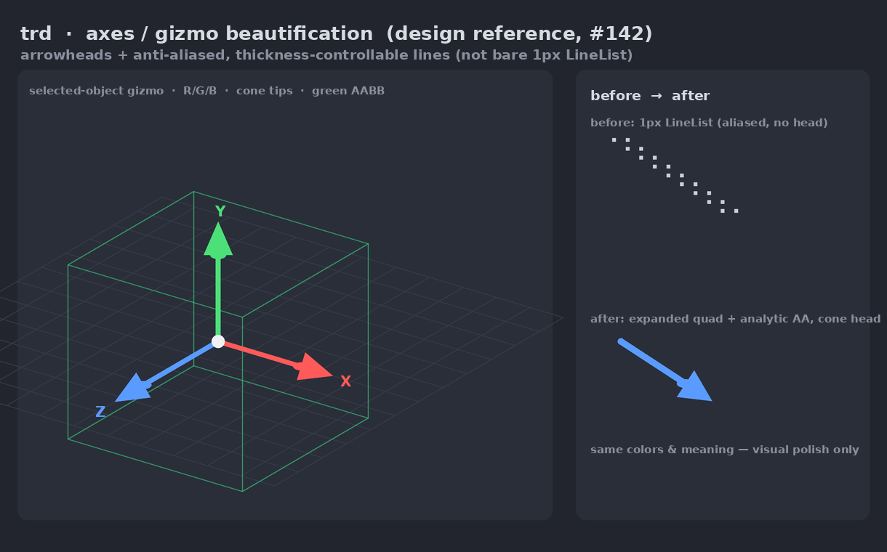

# Rendering & CLI guide

How to drive every front-end — with the `examples/render.sh` / `examples/render.ps1`
wrappers **and** the equivalent direct `cargo run` invocations. The wrappers are
just conveniences that build the `producers → renderer → encoder` pipeline for you;
anything they do, you can run by hand with `cargo run`.

## Contents

- [Wrappers ⇄ `cargo run`](#wrappers--cargo-run)
- [Native CLI (headless)](#native-cli-headless)
  - [Content & appearance flags](#content--appearance-flags)
  - [Rendering appearance](#rendering-appearance)
  - [Camera forms & AR demos](#camera-forms--ar-demos)
- [Native window — `trd-app`](#native-window--trd-app)
- [Interactive viewer — `trd-gui`](#interactive-viewer--trd-gui)
  - [Controls & operations](#controls--operations)
  - [Lighting: the probe, not a virtual rig](#lighting-the-probe-not-a-virtual-rig)
  - [Multi-object scenes & URL params (browser)](#multi-object-scenes--url-params-browser)
- [Video editor — `web/gui-video-editing`](#video-editor--webgui-video-editing)
- [Web (wasm)](#web-wasm)
- [Windows setup (without Nix)](#windows-setup-without-nix)
- [GPU notes](#gpu-notes)

## Wrappers ⇄ `cargo run`

| Wrapper | Direct `cargo run` equivalent |
|---|---|
| `render.sh --cli  IN.jsonl OUT.gif W H FPS` | `obj_to_arrow.py MESH` + `jsonl_to_arrow.py IN.jsonl` piped to `cargo run -p trd-cli -- --width W --height H` piped to `encode.py --fps FPS -o OUT.gif` |
| `render.sh --native` | same producers piped to `cargo run -p trd-app -- --fps FPS` |
| `render.sh --web` | `nix build .#web` (or `cd web/viewer && bun run build`) then serve `dist/` |
| *(interactive viewer)* | `cargo run -p trd-gui-app -- --mesh MESH [--texture IMG]` |

Run either wrapper with **no arguments** to print its full flag guidance. On
Windows use `render.ps1` with `-CLI` / `-Native` / `-Web` and `-InputPath` /
`-Output` / `-Width` / `-Height` / `-Fps`.

## Native CLI (headless)

`trd-cli` (package `trd-cli`) is a pure Arrow filter: mesh-first stream on stdin →
image stream on stdout. It does not encode video — pipe the output to
[`scripts/encode.py`](../scripts/encode.py), which picks the codec from the `-o`
extension (`.mp4`/`.mov` → H.264, `.webp` → animated WebP, else GIF). Use `.mp4`
for 1080p/4K, where a GIF balloons to hundreds of MB.

Wrapper:

```sh
examples/render.sh [MODE] [INPUT.jsonl] [OUT.gif|.webp|.mp4] [WIDTH] [HEIGHT] [FPS]
# MODE: --cli (headless, default) · --native (live window) · --web (browser)
# Defaults: examples/frames.bunny_dolly.cg.jsonl → output/out.gif, 256×256 @ 30 fps
```

The exact `producer → renderer → encoder` pipeline it runs (no intermediate files):

```sh
uv run --with pyarrow scripts/obj_to_arrow.py assets/meshes/bunny.obj  > /tmp/stream.arrow
uv run --with pyarrow scripts/jsonl_to_arrow.py examples/frames.bunny_dolly.cg.jsonl >> /tmp/stream.arrow
cat /tmp/stream.arrow \
  | cargo run -q -p trd-cli -- --width 256 --height 256 \
  | uv run --with pyarrow --with numpy scripts/encode.py --fps 30 -o output/out.gif
```

On Windows the Arrow stages are handed off through a temp dir (PowerShell pipelines
aren't binary-safe); the output is identical.

### Content & appearance flags

The `--cli` flags map straight onto `trd-cli`, so any producer pipeline can use
them (`… | trd --width 1024 --wireframe --aabb | …`):

| Flag | Effect |
|---|---|
| `--mesh <obj>` | Prepend a mesh built from `<obj>` by [`obj_to_arrow.py`](../scripts/obj_to_arrow.py); renders centered + scaled-to-fit. **Repeatable** — several meshes load in order; a frame's `draws` list references them by 0-based index. |
| `--texture ` | Splice a texture stream from `` and render **textured** (samples the image at each vertex UV). Requires `--mesh` with UVs. |
| `--wireframe` | Draw mesh **edges** as a line list instead of filled triangles. |
| `--pbr` | Physically-based **Disney principled BRDF** shading (see [Rendering appearance](#rendering-appearance)). |
| `--aabb` | Overlay each drawn instance's green, thickness-controlled, anti-aliased axis-aligned **bounding box**. |
| `--axes` / `--axes-local` | Overlay smooth R/G/B axes with cone arrowheads at the **world** origin / at **each** drawn object's own model frame. |
| `--frames-base <dir>` | Resolve external `frame_path` backgrounds. Inline `frame_id` resources need no base directory. |
| `--no-msaa` | Disable 4× MSAA (default on the mesh pass). Mesh silhouettes/wireframes become single-sampled; gizmo lines retain analytic AA. |
| `--placement-quad`, `--grid-local xy\|xz\|yz` | AR-placement overlays used by the broadcast demos below. |

Axes, AABBs, and plane grids are expanded into camera-facing triangle quads in
the shader, with edge alpha derived from pixel distance rather than MSAA
coverage. Their pixel widths and the axis-head dimensions are centralized in
`render/gizmo.rs` (`AXES_LINE_WIDTH_PX`, `AABB_LINE_WIDTH_PX`,
`GRID_LINE_WIDTH_PX`, and `AXES_ARROW_*`) for later UI exposure.



```sh
# Single bunny turntable, filled, with its bounding box:
examples/render.sh --cli --aabb --mesh assets/meshes/bunny.obj \
  examples/frames.turntable.jsonl output/bunny.gif 1024 1024 24

# Textured bunny (samples a UV-mapped albedo at each vertex UV):
examples/render.sh --cli --mesh assets/meshes/bunny_with_texture/bunny.obj \
  --texture assets/meshes/bunny_with_texture/bunny_uv_map1.jpg \
  examples/frames.bunny_dolly.cg.jsonl output/bunny_textured.gif 512 512 20

# Two-mesh scene (bunny = mesh 0, cube = mesh 1), wireframe + boxes:
examples/render.sh --cli --wireframe --aabb \
  --mesh assets/meshes/bunny.obj --mesh examples/cube.obj \
  examples/frames.multimesh.jsonl output/scene.gif 1024 1024 24
```

### Rendering appearance

The same stream renders four ways — pick one per render:

- **filled** (default) — per-vertex color.
- **`--wireframe`** — edges as a line list; reveals topology.
- **`--texture `** — samples a bound UV-mapped albedo (`Rgba8UnormSrgb`, linear
  clamp-to-edge). Requires UV-mapped geometry.
- **`--pbr`** — physically-based **Disney principled BRDF** shading. Requires a
  texture stream for the albedo. **Full parameter reference + material model:
  [`docs/pbr.md`](pbr.md).**

#### PBR path

**Rule: `--pbr` is a mesh render mode, not a separate primitive.** It uses smooth
shading normals and these controls:

| Control | Meaning |
|---|---|
| `--metallic` | 0 dielectric → 1 metal |
| `--roughness` | 0 mirror → 1 rough |
| `--specular` | dielectric specular strength |
| `--clearcoat` | colorless secondary specular layer |
| `--env <file.hdr>` | optional equirectangular Radiance HDR probe reflected by metallic surfaces |
| `--env-intensity` | environment-reflection gain |
| `--env-background` | also draw the probe as the **background sky** behind the scene |
| `--env-background-blur` | blur for that background sky |
| `--tonemap reinhard|aces` | HDR output curve; default `reinhard`, `aces` is the filmic curve |
| `--exposure` / `--ambient` | tone-map exposure and ambient fill controls |

```sh
# Shiny metal bunny under an HDR environment probe, ACES tone-map:
examples/render.sh --cli --pbr --metallic 1 --roughness 0.3 --tonemap aces \
  --env assets/envmap/uffizi-large.hdr \
  --mesh assets/meshes/bunny_with_texture/bunny.obj \
  --texture assets/meshes/bunny_with_texture/bunny_uv_map1.jpg \
  examples/frames.bunny_dolly.cg.jsonl output/bunny_pbr.gif 512 512 20
```

Anti-aliasing: the mesh pass renders at **4× MSAA** by default (resolved before
read-back); `--no-msaa` renders single-sampled.

### Camera forms & AR demos

#### Dolly-camera capstone

**Rule: CG and CV camera forms must render the same view.**
[`examples/bunny_dolly.py`](../examples/bunny_dolly.py) authors the *same* camera
**twice**, once **CG** (`eye`/`target`/`up` + `fovy`) and once **CV** (pinhole
`K` + `pose`), as two JSONL streams.

Both decode to the same `P·V` and render identically (verified to differ by
≤ 0.0054 % of pixels) — a proof that the CV and CG paths agree. The CV `K` is
in pixel units, so render the CV stream at the resolution it was authored for.

#### Background compositing

**Rule: background frames are selected by params rows.**
[`examples/bunny_frameplane.py`](../examples/bunny_frameplane.py) authors a
folder of animated stills + a turntable JSONL whose `frame_path` names each one;
`--frames-base <dir>` composites them beneath the spinning bunny.

The standard self-contained protocol e2e uses all 250 annotated Cornell-box
frames as raw native 1920×1080 RGBA tensors and the same placement pipeline as
the path-backed demo:

  ```sh
  uv run --with pyarrow --with pillow --with numpy scripts/extract_frames.py \
    assets/videos/cornellbox/CameraMovement.mp4 --format jpg \
    --width 1920 --height 1080 --embed pixels -o output/cornellbox-inline
  examples/render.sh --cli \
    --frames-table output/cornellbox-inline/frames.arrow \
    --mesh assets/meshes/bunny_with_texture/bunny.obj \
    --texture assets/meshes/bunny_with_texture/bunny_uv_map1.jpg \
    examples/frames.cornellbox.inline.jsonl \
    output/cornellbox-inline-tensor-bunny.gif 1920 1080 25
  ```

This draws only the textured bunny. Its 250 `frame_id` rows preserve the external
`frame_path` demo's camera and placement transforms exactly. See
[frame extraction](frame-extraction.md) for the complete generation recipe.

#### Single-view AR placement

**Rule: the perception pipeline anchors meshes to tracked planar court quads.**
The pipeline (`scripts/{nba,fiba}_perception_to_arrow.py` →
[`examples/placement_quad_by_local_coord.py`](../examples/placement_quad_by_local_coord.py))
uses Pose-free reconstruction so the mesh **stays glued to the same floor spot as
the camera pans and zooms**.

Only the image-free per-frame calibration is vendored
(`assets/videos/{nba,fiba}/…`, see each `DATASET.md`); the copyrighted broadcast
video stays external. The packaged **FIBA / Paris-2024 Olympic** demo (Disney PBR
+ ACES, native 1080p) is one command (`--source` points at the external broadcast
clip):

  ```sh
  examples/olympic-basketball-demo.sh --source ~/Asset/fiba-shot1/shot_0001.mp4
  ```

Run it with no arguments to print its options (drink-can preset, shot, overlays).
See the script header and `render.sh` with no args for the individual stages and
the `--placement-quad` / `--axes-local` / `--grid-local` overlays.
Background-frame tooling: [`docs/frame-extraction.md`](frame-extraction.md).

## Native window — `trd-app`

Opens a window and plays the *same* stream live:

```sh
examples/render.sh --native            # Linux/macOS/WSL
examples\render.ps1 -Native            # Windows (PowerShell 7)

# …or pipe a mesh-first stream straight into trd-app:
cat <(uv run --with pyarrow scripts/obj_to_arrow.py assets/meshes/bunny.obj) \
    <(uv run --with pyarrow scripts/jsonl_to_arrow.py examples/frames.bunny_dolly.cg.jsonl) \
  | cargo run -q -p trd-app -- --fps 30
```

Options: `--width`/`--height` (initial size), `--fps`, `--once` (hold the last
frame instead of looping). Honours `WGPU_BACKEND` / `RUST_LOG`. Close the window to
exit; neither `uv` nor `ffmpeg` is needed.

## Interactive viewer — `trd-gui`

Orbit/zoom/pan and **edit objects** in a native window or the browser — no stream
needed:

```sh
# Native (eframe): defaults to a built-in cube; pass a mesh + texture to view it.
# `--mesh` takes an OBJ or a GLB (sniffed by its `glTF` magic, like the browser).
cargo run -p trd-gui-app -- --mesh assets/meshes/bunny_with_texture/bunny.obj \
  --texture assets/meshes/bunny_with_texture/bunny_uv_map1.jpg


# Browser: build + serve, then load ?mesh=…&texture=… (WebGPU browser).
cd web && bun run --cwd gui-viewer dev
```

### Controls & operations

The central image is the interaction surface; the left panel holds grouped
controls. Everything is **per-object**: click an object to select it, then edit
*that* object.

- **Select (click-to-select).** A left **click** (press+release, no drag) picks the
  object under the cursor via a color-index (ID-buffer) pass and **highlights its
  AABB**; clicking the background **deselects**. The *Selection* panel shows the
  current object and a **Deselect** button. Object edits (transform / render mode /
  material) act on the selected object and are **disabled when nothing is
  selected**.
- **Camera vs. object drag.** *Primary drag* targets either **Orbit camera**
  (default) or **Object**. Left-drag orbits the camera; right/middle-drag always
  **moves the selected object**; scroll **zooms** (dollies the camera).
- **Transform the selected object.** With *Primary drag → Object*, pick a
  **Manipulate** mode — **Rotate / Move / Scale** — and an optional **Axis lock**
  (**Free / X / Y / Z**): a locked drag rotates **about** or translates **along**
  that one axis (scroll scales in Scale mode). The **Transform** panel mirrors this
  with numeric **Translation** (x/y/z), **Rotation** (X/Y/Z°), and **Scale**
  (uniform + per-axis) — the widgets and the mouse stay in sync (dragging updates
  the numbers and vice-versa).

- **Render mode (per object).** The **Render mode** selector sets the selected
  object's mode — **Filled / Wireframe / Textured / PBR** — so objects can mix modes
  in one scene.
- **PBR appearance (per object).** When the selected object is in **PBR** mode,
  the panel edits its typed Disney surface, IBL intensity, and tone mapping live
  — **Metallic / Roughness / Clearcoat / Env intensity / Exposure** and the
  **Reinhard/ACES** operator. **PBR view** switches between Shaded, Roughness,
  Metallic, and Normal diagnostics.
- **Overlays.** Toggle the **Bounding box** (all objects), **World axes**, **Local
  axes**, **XZ plane grid** (**World** floor / **Local** per-object), and the
  spherical HDR background; background blur and the scene's single
  Background/IBL rotation are adjustable.
- **Load / delete models at runtime.** The **Model** panel's **Load model…**
  opens a file picker — `rfd` natively, a hidden `<input type=file>` in the
  browser — and adds the chosen **GLB** to the *running* scene, selected and
  ready to transform; **Delete selected** removes an object and frees its GPU
  memory. A rejected file (not a GLB, corrupt, or over the 1 GiB ceiling) shows
  a typed error beside the button and **leaves the current scene rendering**.
- **Reset view** restores the camera + every object's transform.

### Lighting: the probe, not a virtual rig

The viewer is lit by **image-based lighting alone** — no key/fill/rim rig and no
ambient fill by default, the same rig the video editor lights the Dragon with. A
real PBR material lit by both a probe *and* a three-light rig is double-lit and
washes out, which is why the rig is gone rather than merely dimmed.

That makes a probe non-optional, so one is **always bound**: `--env` / `?env=`
when given, otherwise the built-in `assets/envmap/uffizi-large.hdr`. Two
consequences worth knowing:

- **A bound probe does not draw a sky.** The environment *lights* the scene;
  the backdrop appears only when **Environment background** is ticked.
- **`--ambient` / `--exposure` / `--tonemap` follow the asset.** A glTF asset
  defaults to the ACES grade at unit exposure (what `?mesh=<glb>` already used),
  an OBJ to Reinhard at 1.2. An explicit flag still wins over both.

### Multi-object scenes & URL params (browser)

Load several objects and pick between them. The browser reads scene inputs from
query params — the equivalents of the native `--mesh`/`--texture`/`--env`/
`--backend` flags:

| Param | Meaning |
|-------|---------|
| `?mesh=<url>` | An object's OBJ or single-primitive GLB. **Repeatable** — each `?mesh=` adds an object laid out side-by-side; GLB starts in PBR and uses its embedded base-color, metallic-roughness, normal maps, and material. Objects can also be added after load via **Load model…**. |
| `?texture=<url>` | **Positional** albedo: the *i*-th `?texture=` skins the *i*-th `?mesh=` (each object its own diffuse). |
| `?env=<url>` | An equirectangular HDR probe, **overriding** the built-in Uffizi one. Every object starts in PBR; the probe lights the scene but is not drawn behind it until **Environment background** is ticked. |

```
# Three objects (coke can, textured bunny, beer can), each with its own diffuse,
# lit by an HDR env (PBR). Click one to select + edit it independently.
http://localhost:8080/?mesh=/assets/meshes/can/coke.obj&texture=/assets/meshes/can/can_around.jpg\
&mesh=/assets/meshes/bunny_with_texture/bunny.obj&texture=/assets/meshes/bunny_with_texture/bunny_uv_map1.jpg\
&env=/assets/envmap/uffizi-large.hdr
```

> Each object carries its own **transform, render mode, Disney material, PBR
> maps, IBL intensity, tone mapping, and debug view** — the probe's *yaw* is
> scene-level, so the sky and every reflection share it. The renderer
> composes those typed values per mesh, so per-object appearance is real, not
> shared. On the headless RTX Linux box, reach the browser viewer over an SSH
> port-forward (see [`AGENTS.md`](../AGENTS.md#cross-mode-e2e-recipe--coca-cola-can-pbr--aabb--axes)).

## Video editor — `web/gui-video-editing`

The dedicated FIBA editor is a sibling of the generic stream viewer and GUI
viewer in the shared `web/` Bun workspace. Generate the ignored
`web/gui-video-editing/data/fiba-shot1.arrow` document first using
[`video-editing.md`](video-editing.md#generate-the-document), then:

```sh
cd web
bun run --cwd viewer build:wasm  # stage the local trd-wasm file dependency
bun install --frozen-lockfile
bun run --cwd gui-video-editing dev  # http://localhost:8085
```

The same commands run natively in PowerShell 7 on Windows; no WSL or Nix is
required.

Open the local `shot_0001.mp4` or an HTTP(S) video URL, select the tracked quad,
then place/edit Coke, beer, or Dragon. mediabunny owns demux/decode and
`VideoPlayer` owns playback; Rust maps each
presented frame to the separate `0.2.0` Arrow timeline and renders the video,
placed mesh, and editor overlays. This is not the `0.0.6` render protocol:
edited-scene export to `[mesh][texture?][frames][params]` remains future work.

See [`video-editing.md`](video-editing.md) for the document generation command,
schema, quad basis, lighting defaults, playback visibility, SSH tunnel, and
known tracking-jitter behavior.

Native media/timeline shell:

```sh
cargo run -p trd-gui-video-editing -- \
  --document web/gui-video-editing/data/fiba-shot1.arrow \
  --video /path/to/shot_0001.mp4
```

The native adapter uses ffprobe for source validation and streams ffmpeg RGBA
frames through a Rust channel. Play/pause/seek restarts or invalidates the
decoder stream; it does not extract temporary JPEGs. This first native slice
shows video/poster, timeline, and tracked/video-only status. Native 3D
placement/editing parity remains #167 follow-up work.
Use `--probe-only` for a headless metadata + frame-0 decode smoke test.

## Web (wasm)

```sh
nix build .#web    # Rust core → wasm-bindgen lib → bun dist/  (in ./result)
nix run   .#web    # serve dist/ over HTTP  (PORT, default 8080)
```

`render.sh --web` (alias `--wasm`) is the **in-browser twin of `--cli`**: it runs
the same Arrow producers at the same scene flags, writes `stream.arrow` +
`config.json` (+ background stills with `--frames-base`) next to the bundled
`index.html`, and serves it — printing the machine URL and a ready-to-copy
SSH-tunnel command:

```sh
# On-screen WebGPU canvas (default); tune fps live, resolution is baked in:
examples/render.sh --web --canvas-renderer --placement-quad --axes-local \
  --frames-base output/cornellbox \
  examples/frames.cornellbox.stage1.jsonl '' 960 540 25   # open http://localhost:8080/?fps=30

# Offscreen renderer read back to a 2D canvas (browser twin of --cli output):
examples/render.sh --web --offscreen-renderer --mesh assets/meshes/bunny_with_texture/bunny.obj \
  --texture assets/meshes/bunny_with_texture/bunny_uv_map1.jpg \
  --frames-base output/cornellbox \
  examples/frames.cornellbox.stage2.jsonl '' 960 540 25
```

Every `--cli` content flag applies to `--web` unchanged (`--grid-local` is
native-only). The render resolution is baked into the stream's CV `k`, so it is a
positional argument, **not** a URL param; the only live URL param is **`?fps=N`**.
Two targets share the bundle: **`--canvas-renderer`** (on-screen WebGPU) and
**`--offscreen-renderer`** (offscreen texture → 2D canvas).

The wasm core is a standard, TypeScript-typed npm package. The generic viewer
replays a prebuilt stream by index — decoding it **once** with `loadIpc`:

```ts
import init, { CanvasRenderer } from "trd-wasm"; // fully typed

await init({ module_or_path: wasmUrl });
const canvas = await CanvasRenderer.create(canvasEl);
const total = canvas.loadIpc(streamBytes); // decode + buffer all frames
canvas.renderIndex(0);                     // draw buffered frame 0
```

`OffscreenRenderer` is the offscreen counterpart: `renderIndex(i)` is **async**,
returning that frame's RGBA `Uint8Array` to paint onto a 2D canvas. Both also keep
the streaming `pushIpc` path (append input / emit output, `finish()` → EOS) for
producer-driven pipelines.

For local iteration inside `nix develop`, all browser surfaces share the Bun
workspace rooted at `web/`:

```sh
cd web
bun run --cwd viewer build:wasm     # clean-checkout bootstrap for file: dependency
bun run --cwd gui-viewer build:wasm
bun run --cwd gui-video-editing build:wasm
bun install --frozen-lockfile
bun run typecheck                    # all three packages
bun run check                        # all three Biome gates
bun run --cwd viewer dev             # stream viewer, :8080
bun run --cwd gui-viewer dev         # interactive GUI viewer, :8082
BUN_PORT=8085 bun run --cwd gui-video-editing dev
```

`web/`'s npm deps are installed offline in the Nix sandbox via
[bun2nix](https://github.com/nix-community/bun2nix) (`web/bun.nix` pins
them by hash from `web/bun.lock`); regenerate it after changing
`web/bun.lock` — see
[`AGENTS.md`](../AGENTS.md#toolchain) for the exact command.

> **Windows:** `render.ps1 -Web` builds the same generic `web/viewer` delivery
> surface with `wasm-pack` + Bun (no Nix); `render.sh --web` uses the Nix-built
> package on Linux.

## Windows setup (without Nix)

There is no `nix develop` on Windows. Its counterpart is
[`scripts/dev-env.ps1`](../scripts/dev-env.ps1), which prepares the current
PowerShell 7 session the same way the flake's dev shell does.

**1. Install the toolchain (one time).** Rust (`rustup`) + the MSVC C++ build tools
are required to build and link the core; the render-example extras are optional:

```powershell
# Required: Rust + MSVC C++ build tools (use the MSVC host, not -gnu).
winget install --id Rustlang.Rustup -e
winget install --id Microsoft.VisualStudio.2022.BuildTools -e `
  --override "--quiet --add Microsoft.VisualStudio.Workload.VCTools --includeRecommended"

# Optional render tools: ffmpeg (GIF/WebP/MP4 path) + uv (pyarrow producers).
winget install --id Gyan.FFmpeg -e
winget install --id astral-sh.uv -e
```

**2. Prepare each shell** — dot-source the setup script to put cargo (pinned to the
MSVC host), the MSVC linker, ffmpeg, and uv on `PATH`:

```powershell
. .\scripts\dev-env.ps1     # prints a dev-shell-style tool summary
```

**3. Build and render:**

```powershell
cargo build -p trd-cli
examples\render.ps1 -CLI    # render → output\out.gif
```

Notes:

- Use the **MSVC** Rust host, not `-gnu` (wgpu's raw-dylib deps crash on `-gnu`);
  `dev-env.ps1` runs `rustup set default-host x86_64-pc-windows-msvc` for you.
- `render.ps1` auto-sources `dev-env.ps1` (`-NoInstall`), so step 2 is optional when
  you only run the wrapper.
- The **web** wrapper builds on Windows with just `bun` (no Nix):
  `cd web; bun run --cwd viewer build:wasm;
  bun run --cwd gui-viewer build:wasm; bun install --frozen-lockfile;
  bun run typecheck; bun run check`.

## GPU notes

On WSL, prefix GPU commands with `WGPU_BACKEND=gl` (otherwise rendering is
software). On a native (non-NixOS) Linux GPU box, the `nix develop` Vulkan loader
can't reach the host driver — wrap GPU commands with
[nixGL](https://github.com/nix-community/nixGL):

```sh
NIXPKGS_ALLOW_UNFREE=1 nix run --impure github:nix-community/nixGL#nixGLNvidia -- \
  examples/render.sh --cli      # or --native / --web; #nixGLIntel for Intel/Mesa
```

Full GPU-adapter-selection details are in [`AGENTS.md`](../AGENTS.md#gpu).
